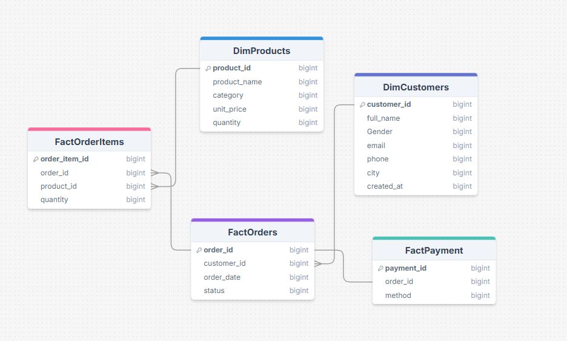

# 🛒 UrbanCart – Analysis Business Insights by (SQL Analysis)

This project presents a **SQL-based retail case study** analyzing UrbanCart, a growing online retail platform operating across multiple cities.  
The analysis focuses on sales performance, customer behavior, product trends, and business insights using **PostgreSQL**.

---

## 📌 Project Overview

UrbanCart sells a wide range of consumer products and processes thousands of orders every month.  
The goal of this project is to analyze transactional data and generate actionable insights to support **better business decisions**.

---

## 🗄️ Database & Data Setup

- Database: **PostgreSQL**
- Hosting Platform: **Supabase**
- Data Type: Transactional & Dimensional Data
- Tables include:
  - Customers
  - Orders
  - Order Items
  - Products
  - Categories
  - Inventory

The database was hosted in Supabase and accessed using PostgreSQL for querying and analysis.

---

## 🧩 Entity Relationship (ER) Diagram

The following ER diagram represents the structure of the UrbanCart database used in this analysis:

> *(Replace the image path with your actual image location in GitHub)*

---

## 🔍 Key Analysis Performed

- Sales and revenue analysis by city and category
- Customer purchasing behavior over time
- Payment method analysis by city
- High-value order analysis
- Product co-occurrence and bundle recommendations
- Stock risk and inventory analysis

---

## 📊 Business Insights

- Identified top-performing cities and categories by revenue
- Found customer payment preferences across cities
- Discovered frequently ordered product pairs for cross-selling
- Highlighted stock-out risk products based on demand and inventory

---

## 🛠️ Tools & Technologies

- **PostgreSQL**
- **Supabase**
- **SQL (CTEs, Joins, Aggregations)**
- **Excel** (Dashboard & Visualization)
- **GitHub** (Version Control & Documentation)

---

---

## 🚀 Conclusion

This project demonstrates how SQL can be used to analyze retail data and extract meaningful insights that support business growth, operational efficiency, and strategic decision-making.

---

## 👤 Author

**Riyad Shikdar Arin**  
Aspiring Data Analyst | SQL | PostgreSQL | Excel

## 📁 Project Structure

