# 🛒 UrbanCart – Analysis Business Insights by (SQL Analysis)

This project presents a **SQL-based retail case study** analyzing UrbanCart, a growing online retail platform operating across multiple cities.  
The analysis focuses on sales performance, customer behavior, product trends, and business insights using **PostgreSQL**.

---

## 📌 Project Overview

	**UrbanCart** is a growing online retail platform operating across multiple cities. It offers a wide range of consumer products and processes thousands of customer orders each month. This analysis aims to uncover key **business insights** that can help **UrbanCart** make better **decisions** and improve overall **business performance**. 

---

## 🗄️ Database & Data Setup

- Database: **PostgreSQL**
- Hosting Platform: **Supabase**

The database was hosted in Supabase and accessed using PostgreSQL for querying and analysis.

---

## 🧩 Slide Overview
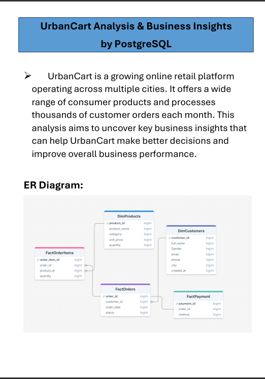

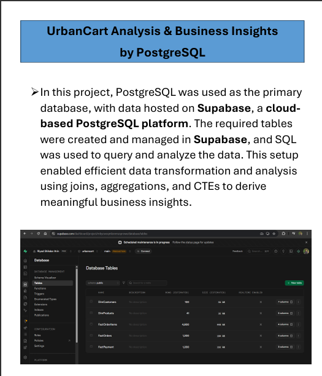

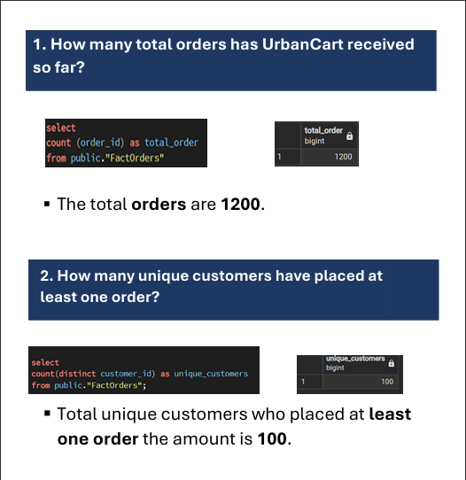

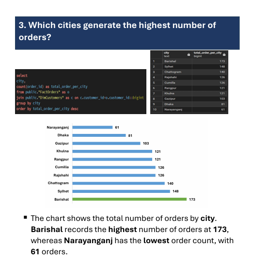

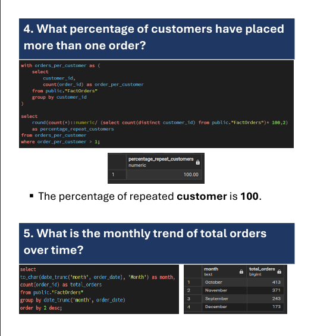

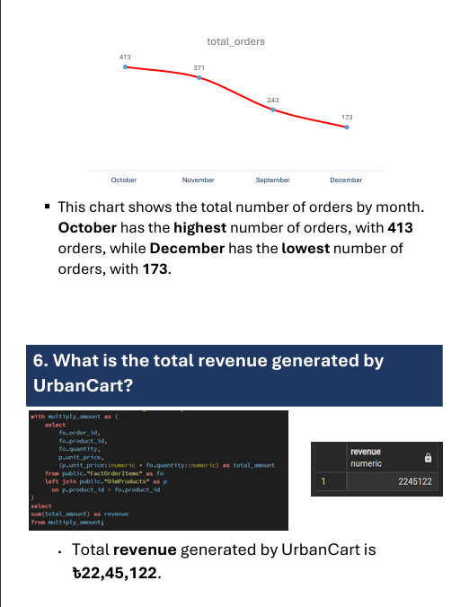

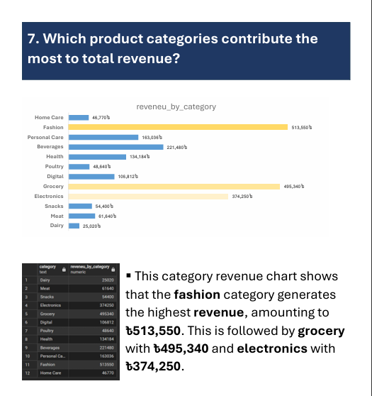

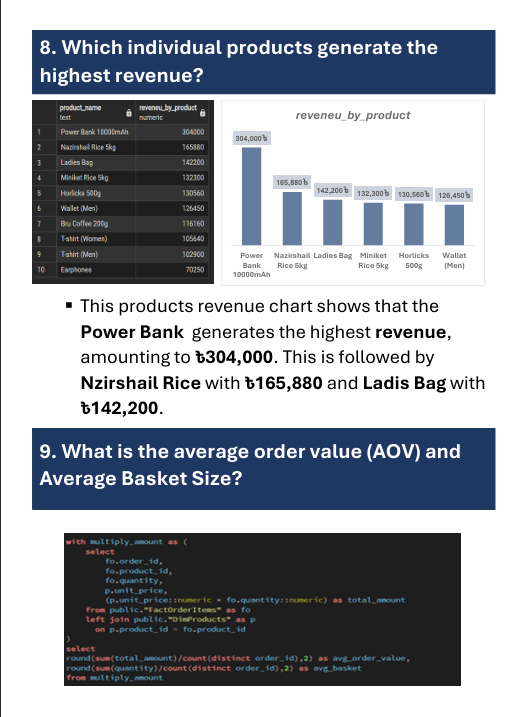

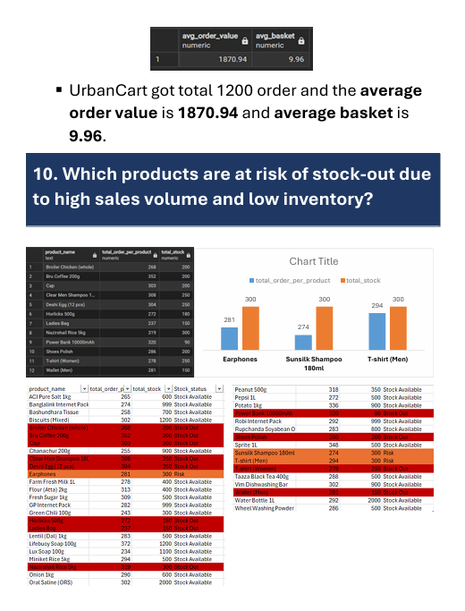

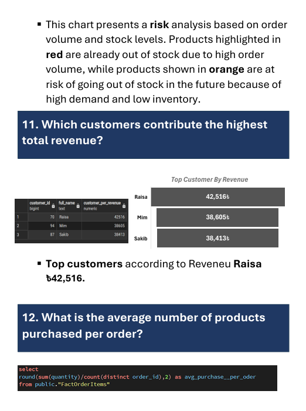

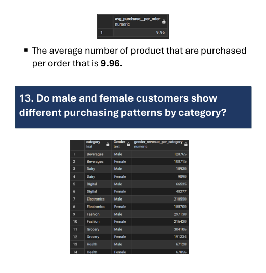

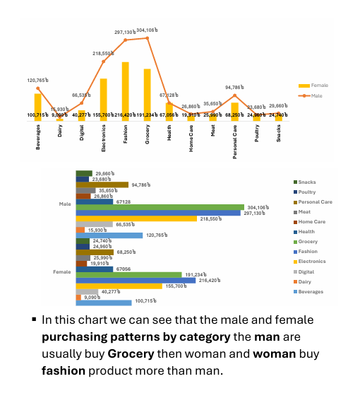

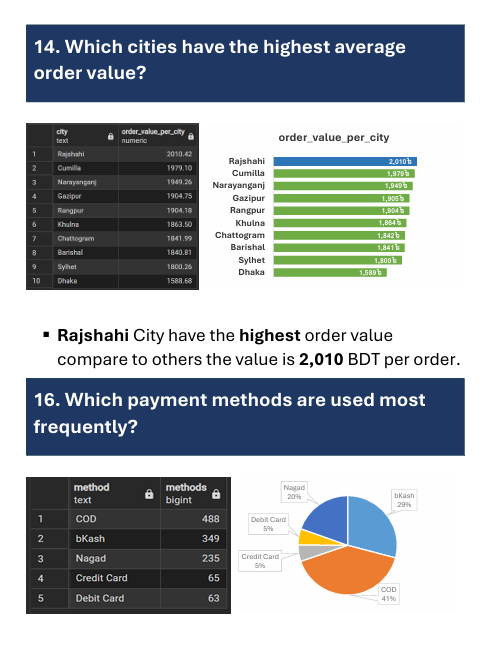

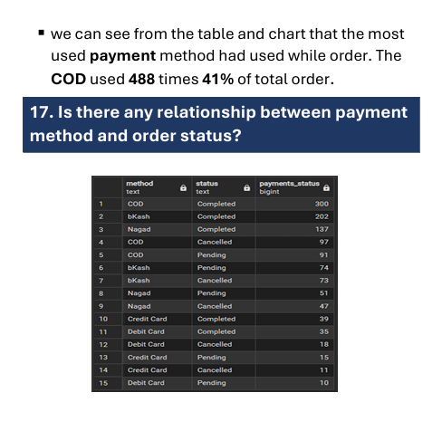

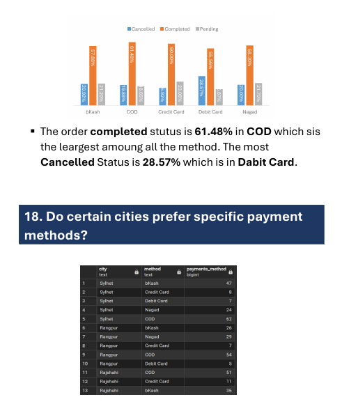

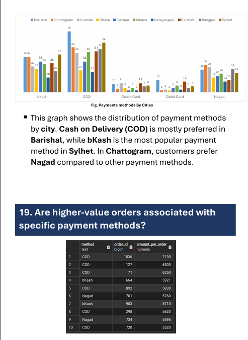

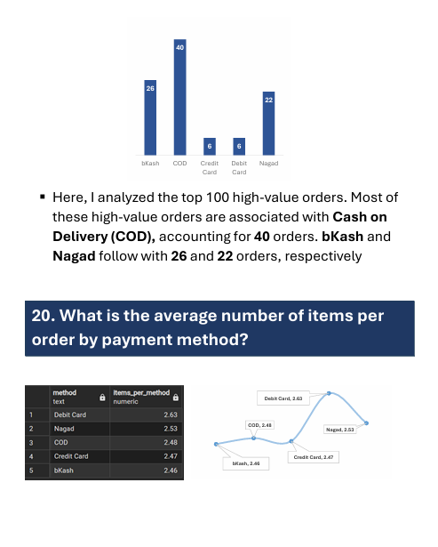

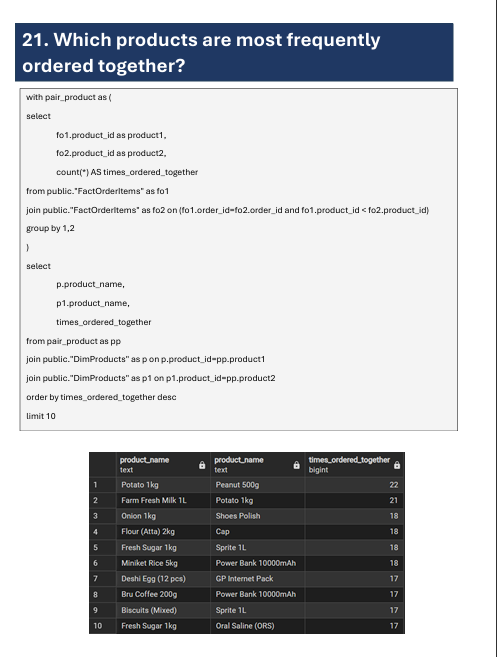

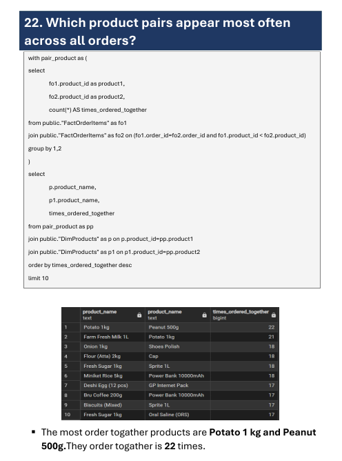

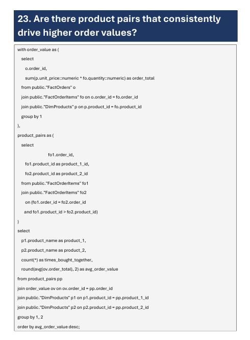

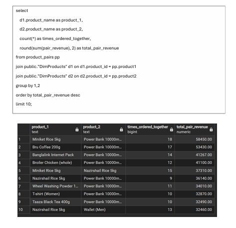

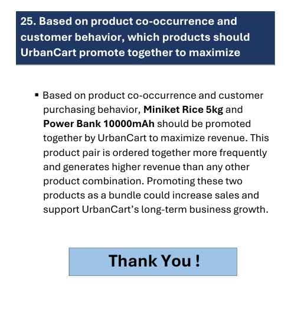

## 🛠️ Tools & Technologies

- **PostgreSQL**
- **Supabase**
- **SQL (CTEs, Joins, Aggregations)**
- **Excel** (Dashboard & Visualization)
- **GitHub** (Version Control & Documentation)

---

---

## 🚀 Conclusion

This project demonstrates how SQL can be used to analyze retail data and extract meaningful insights that support business growth, operational efficiency, and strategic decision-making.

---

## 👤 Author

**Riyad Shikdar Arin**  
Aspiring Data Analyst | SQL | PostgreSQL | Excel

## 📁 Project Structure

